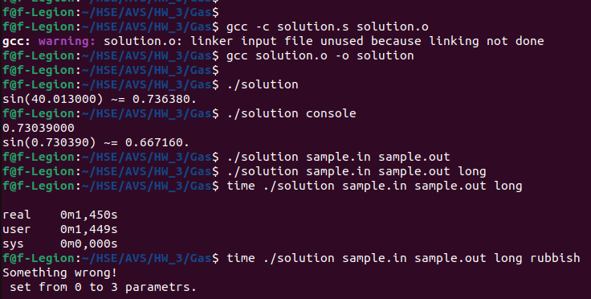
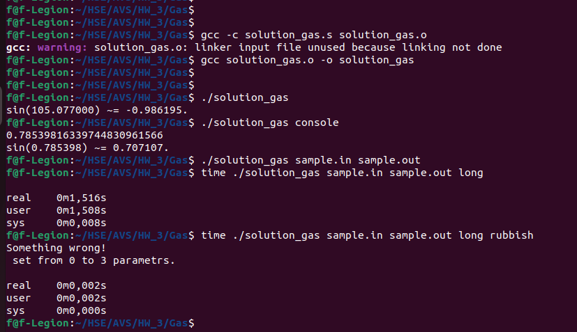
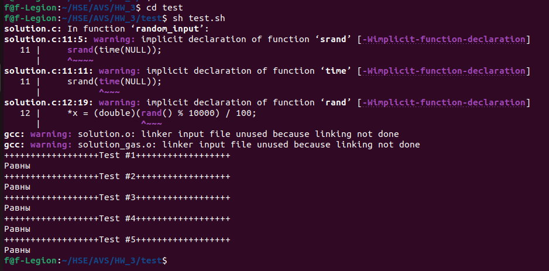
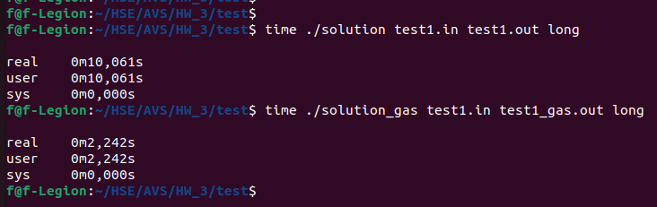

# Третье домашнее задание по архитектуре вычислительных систем
## Фирсов Федор БПИ219 Вариант 7

Разработать программу, вычисляющую с помощью степенного ряда с точностью не хуже 0,05% значение функции sin (x) для заданного параметра x.

### Решение.
#### Я надеюсь что ничего не упустил и это работа на 9)

Мной были написанв 2 решения на Cи и ассемблере. С ними можно ознакомиться в файлах [solution.c](C/solution.c) и [solution_gas.s](Gas/solution_gas.s).

Каждое из решений было собрано и протестировано на семл тестах:

 

Как видно оба решения работают и для консольного, и для файлового, и для случайного ввода вывода.

### Тестирование.

Для проверки эквивалентности и правильности решений я написал [скрипт](test/test.sh), который проверяет корректность ответов для всех случаев: число от 0 до 2 * Pi, число от 0 до Pi / 2 (отрицательный ответ), числа меньше 0 но больше -2 Pi, числа меньше -2Pi, числа сильно большего 2Pi.
На всех тестах решение работает корректно.

Для сравнения по времени я выполнял основное тело программы 1е8 раз + 1 файловый ввод-вывод. Результат стльно меня удивил:

Как мы видим рукописное решение сильно эффективнее. Не очень понятно почему(
